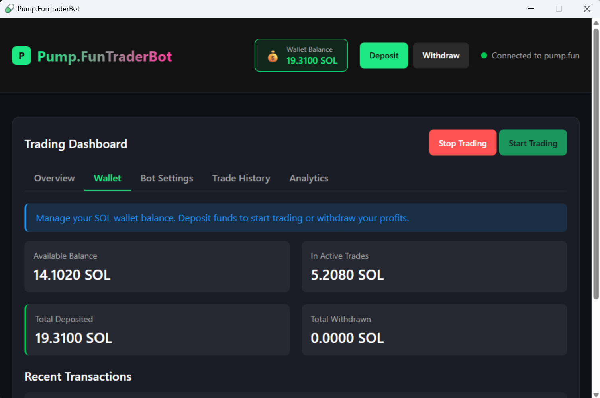

# PumpFun-Trading-Bot
Advanced Solana trading bot with automated strategies, real-time portfolio tracking, and secure deposit management. Trade smarter with AI-powered insights and instant execution.

The Solana Trading Bot is a powerful, user-friendly automated trading solution designed for both beginners and experienced traders in the Solana ecosystem. Built with cutting-edge technology, this bot enables you to execute sophisticated trading strategies 24/7 without manual intervention.

**Key Features:**

- **Automated Trading Strategies**: Deploy proven trading algorithms that work around the clock
- **Real-Time Portfolio Tracking**: Monitor your holdings, profits, and performance metrics in real-time
- **Secure Deposit System**: Easy SOL deposits with QR code support and instant confirmations
- **Smart Risk Management**: Built-in safeguards with customizable deposit limits (0.1-10 SOL)
- **Lightning-Fast Execution**: Take advantage of market opportunities with instant trade execution
- **User-Friendly Interface**: Clean, intuitive dashboard accessible from any device
- **Transaction History**: Complete audit trail of all your trades and deposits
- **Network Confirmation Tracking**: Real-time updates on deposit confirmations

Whether you're looking to automate your trading strategy, diversify your portfolio, or simply save time, this Solana Trading Bot provides the tools you need to succeed in the fast-paced world of cryptocurrency trading.
